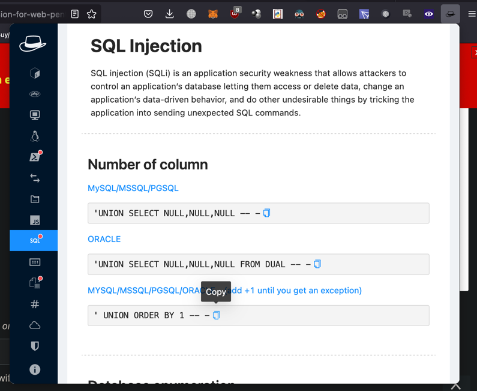
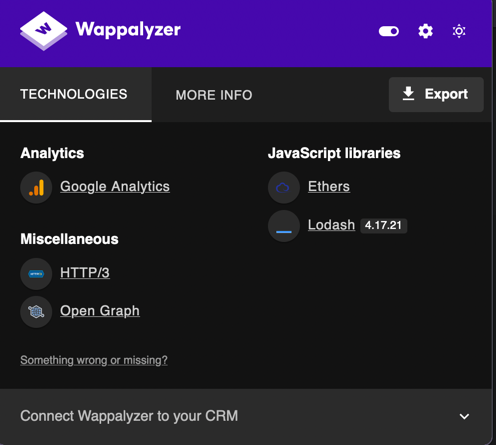
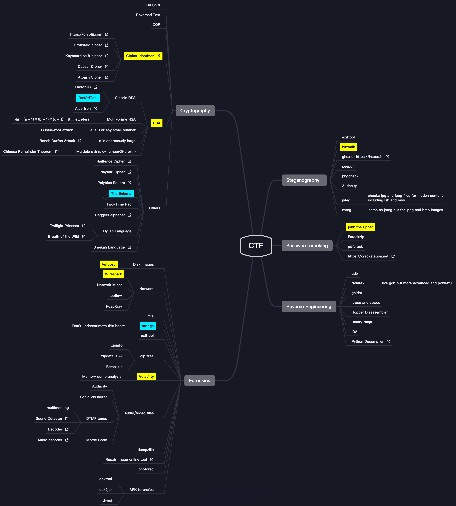

###### РЕКОМЕНДУЮ СТАВИТЬ КАЛИ ЛИНУКС И ЗАРАНЕЕ СТАВИТЬ ВСЁ ИЗ ВАШЕЙ КАТЕГОРИИ

# Cryptography
- [dcode (france)](https://www.dcode.fr/rot-13-cipher)
  - расшифровка всего
  - вбиваете в поиск шифр и оно откроет решалку данного шифра
  - умеет решать даже судоку)
- [crack station](https://crackstation.net/)
  - расшифровывает некоторые хеши
  - богатая база хешей(радужная таблица) 15 gb
- [hashes.com](https://hashes.com/en/decrypt/hash)
  - расшифровывает некоторые хеши
- [Hash identifier](https://www.kali.org/tools/hash-identifier/)
  - Проверка какой это хеш
  - [Online 1](https://www.tunnelsup.com/hash-analyzer/)
  - [Online 2](https://hashes.com/en/tools/hash_identifier)

# Network
- [wireshark](https://www.wireshark.org/#download)
  - в основном для загрузки pcap файлов содержащих кучу сетевых пакетов
  - внимательно читайте задание и ищите то что говорят
- [fiddler](https://www.telerik.com/download/fiddler-everywhere) 
  - подмена ответов запросов
- [burp suite](https://portswigger.net/burp/communitydownload)
  - подмена запросов и их отправка
  - и много других неизученых мною фич

# Web
#### XSS:
- Использовать webhook.site для возвратного получения данных(callback)
- 
- В примере выше я отправляю на вебхук куки в качестве открытия страницы с названием куки

#### Extensions:
- шпоры по sql и тд
  - Firefox: https://addons.mozilla.org/en/firefox/addon/hacktools/ 
  - Chrome: https://chrome.google.com/webstore/detail/hack-tools/cmbndhnoonmghfofefkcccljbkdpamhi
  - 

#### VPN:
- [windscribe](https://windscribe.com)
  - делаете аккаунт, затем в настройках аккаунта вводиться промокод "ПИЗДЕЦ" дает 30 гб
- [cloudflare warp](https://1.1.1.1/)
  - впн от cloudflare 

# Forensics
- Дампы памяти (.mem файлы) 
  - HxD Hex Editor 
    - редактор сырых данных
  - Volatility 
    - инструмент поиска и анализа инфы (ТОП) 
  - Binwalk 
    - поиск исполняемых и других файлов в картинке
  - Foremost 
    - поиск файлов из дампа
- Strings 
  - иногда полезно для получения строк из исполняемого файла
- Восстановление удаленных файлов
- Контейнеры 
  - Veracrypt, Truecrypt

# Assembler

- [Ida Decompiler](https://out7.hex-rays.com/files/idafree77_windows.exe)
  - визуализация кода в виде графа
- [Assembler Reference](http://ref.x86asm.net/coder32.html#modrm_byte_16)
  - это сайт с инструкциями в ассемблере и их значениями в шестнадцатеричной системе счисления.
- [GDB Documentation](https://www.sourceware.org/gdb/documentation/)
  - мануал по gdb
- [Radare2](https://github.com/radareorg/radare2)
  - красивый gdb
- [BenEater](https://www.youtube.com/c/BenEater?app=desktop)
  - ютубер, объясняет ассемблер

# Vulnerability search
- [snyk-cli](https://docs.snyk.io/snyk-cli)
  - имбище(must have)
  - Ищет уязвимости в определенной папке.
  - Для тех заданий, где предоставлены исходники.
  - Даже если цель задания в другом, сканируйте код всё равно, может быть обходной путь.
- [sqlmap](https://sqlmap.org/)
  - Взлом sql и поиск уязвимостей в sql базе
- [thc-hydra](https://www.kali.org/tools/hydra/)
  - Bruteforce универсальный - thc-hydra
  - [Github](https://github.com/vanhauser-thc/thc-hydra)
- [Math.random() JS](https://www.youtube.com/watch?v=-h_rj2-HP2E)
  - взлом псевдо рандома в js
- [wappalayzer](https://addons.mozilla.org/en-US/firefox/addon/wappalyzer/)
  - получения технологий которые использует сайт
  

    
Картинка

    
  

- [Insecure Deserialization Attack](https://www.youtube.com/watch?v=jwzeJU_62IQ)
  - атака на десиариазацию(восстановление обьектов из файла)
- [HTTP pollution](https://www.youtube.com/watch?v=QVZBl8yxVX0)
  - подмена параметров
- [XSS guide](https://www.youtube.com/watch?v=EoaDgUgS6QA)
  - полный разбор XXS(инъекция скрипта вместо текста)
- [Cross-Site Request Forgery](https://www.youtube.com/watch?v=eWEgUcHPle0)
  - получение куки через подмен получателя куки

# Uncategorized(НАДО СОРТИТЬ!!!):
- [awesome-ctf](https://project-awesome.org/apsdehal/awesome-ctf#solve)
  - multi tools
- [ctf-tools](https://github.com/zardus/ctf-tools)
  - multi tools
- [ctf-checklist](https://fareedfauzi.gitbook.io/ctf-checklist-for-beginner/)
- 
  ###### CTFCheatsheet.xmind